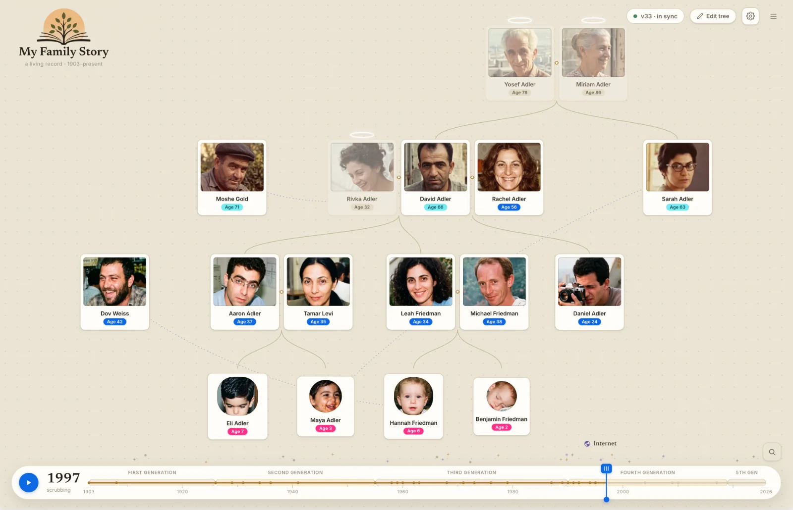
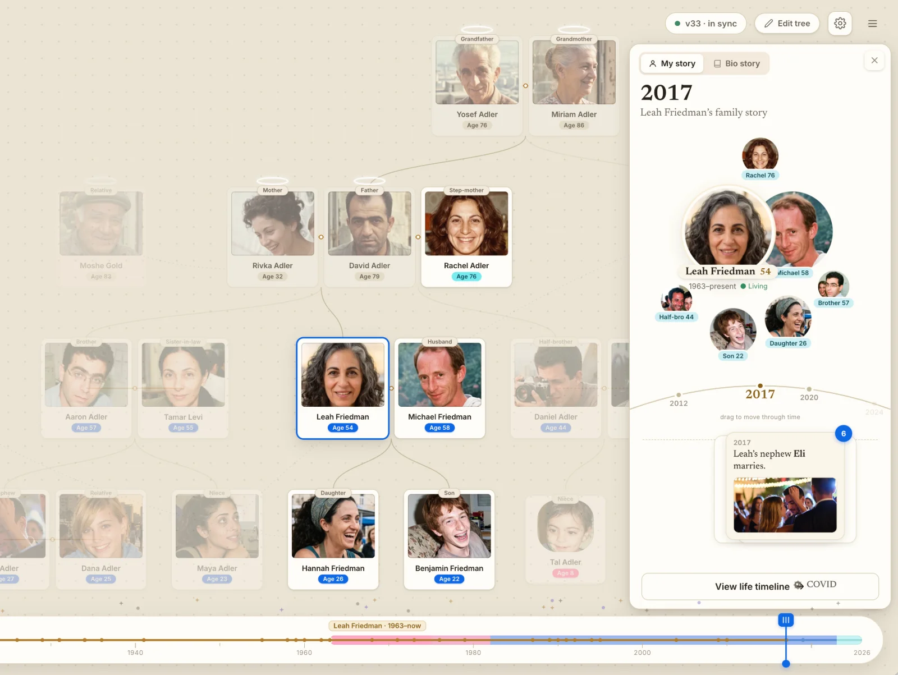
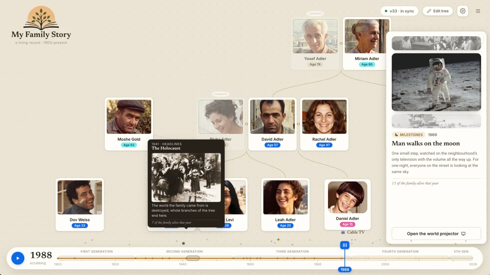
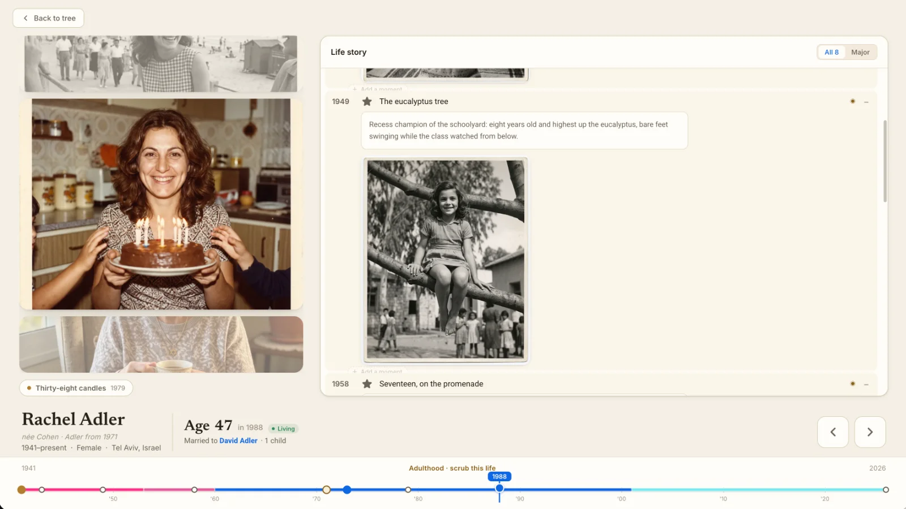
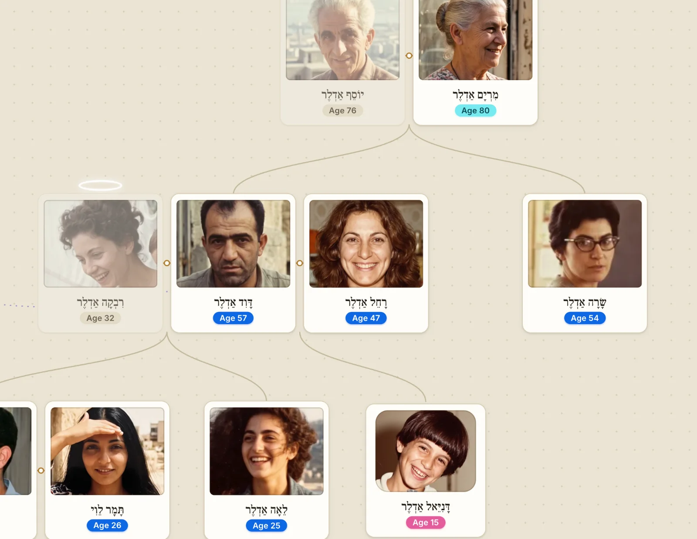
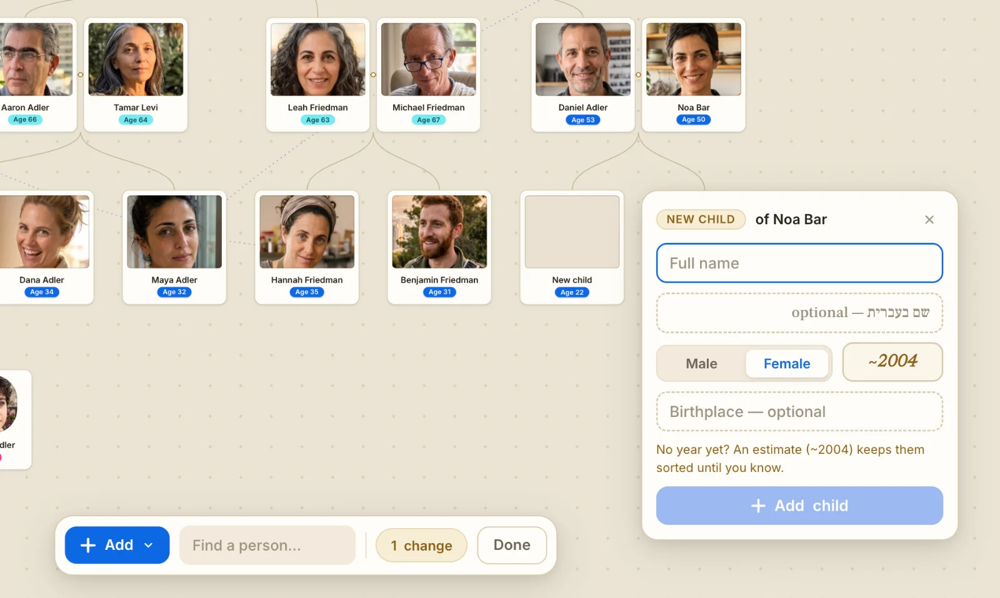
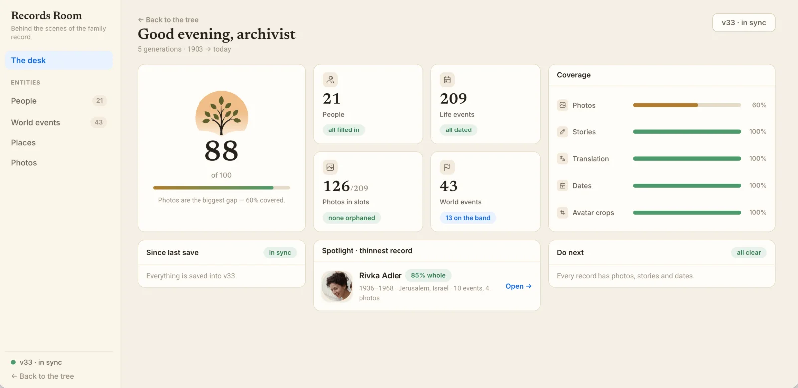
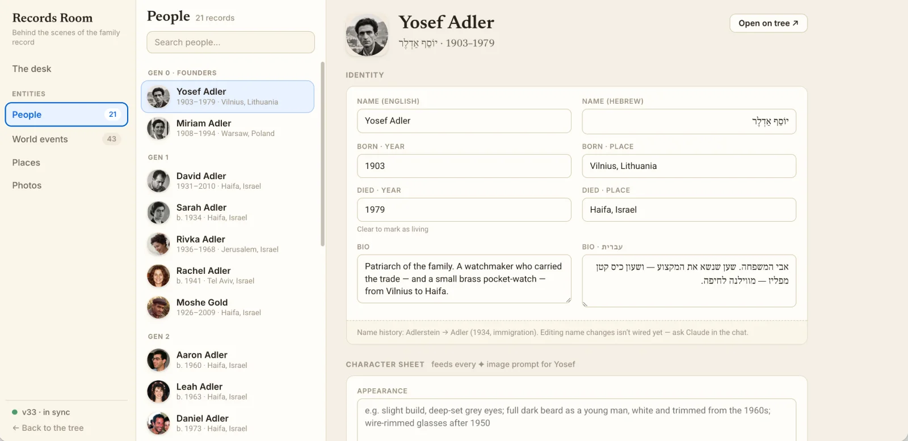
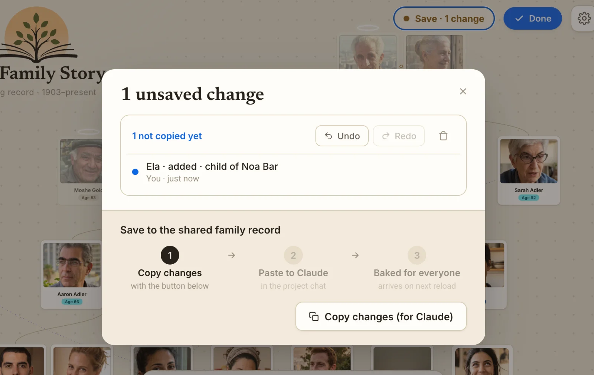

# My Family Story 🌳

*A living record of your family - built to be explored together, one year at a time.*

**App version: v1.1.0** · [changelog](CHANGELOG.md)



**My Family Story** is an interactive family tree that treats your family not as a chart, but as a story. Drag the timeline and watch the family grow, generation by generation. Open any person and step through their life - first steps, weddings, migrations, quiet Friday dinners - told in photos and small written moments, in English and Hebrew.

It was made for two kinds of evenings:

- **Family evenings**: parents and grandparents sitting with kids, scrubbing through the years, drilling into the stories behind the photos. ("Wait, Grandpa had a *motorcycle*?")
- **School roots projects**: a place for a child to collect the stories they gather from relatives, and end up with something the whole family keeps.

Everything here ships with a **fictional demo family (the Adlers, 1903–today)** so you can feel how it works before you pour your own family in.

And it was **born to live in AI environments** - [Claude design, Claude Code, or any tool](#working-on-it-with-claude) that can read a folder. You work on it both through the chat *and* through some special [UI voodoo](#saving-your-work--the-publish-flow) (edits in the app become a change-set the AI "bakes" into the files).

**[קראו את המדריך בעברית ← README.he.md](README.he.md)**

---

## Table of contents

1. [A tour of the app](#a-tour-of-the-app)
2. [Opening it & editor mode](#opening-it--editor-mode)
3. [Adding people, photos & moments](#adding-people-photos--moments)
4. [Working on it with Claude](#working-on-it-with-claude)
5. [The Records Room](#the-records-room)
6. [Saving your work - the publish flow](#saving-your-work--the-publish-flow)
7. [Importing into your own Claude workspace](#importing-into-your-own-claude-workspace)
8. [Starting from scratch - clearing the demo](#starting-from-scratch---clearing-the-demo)
9. [Working with Claude Code or other AI tools](#working-with-claude-code-or-other-ai-tools)
10. [What's in the box](#whats-in-the-box)
11. [The story behind this project](#the-story-behind-this-project)
12. [License](#license)

---

## A tour of the app

### The tree & the time scrubber

The main screen is the family tree - but it lives *in time*. The scrubber along the bottom runs from the first recorded birth to the present day:

- **Drag the year** and people appear as they're born, age through era-appropriate photos, marry, and pass on.
- **Every stop is a time capsule**: the family exactly as it stood *that* year: who was at the table, how old everyone was, side by side, with the world events of the moment as backdrop.
- **Press play** to let the century roll by on its own.
- **Click a person** for a summary card: family links, latest life event, and a bio. Their own life-line - childhood to adulthood - appears above the family timeline, and the story retells itself from their perspective.



- **World events** (wars, moon landings, the first TV broadcast…) twinkle along the timeline band - click one to see how it touched the family.




Settings (⚙) let you toggle **English / עברית**, side-links (godparents, "raised him" ties), how surnames are shown (at birth / current / as-they-were-then), and life-event effects.

### The focus view — one person's life

Double-click a person (or hit "View life timeline" on their card) to enter their life:



- A **life projector** of their photos - scroll or click through the years.
- The **life story log**: every event, from birth to today, with the little stories behind them.
- A **personal timeline** at the bottom, colored by life chapters - childhood, youth, later years.
- Arrows to step event-by-event, and **"Add a moment"** between any two entries (more below).

### Bilingual by heart

Every name, story, and world event can carry both an English and a Hebrew version. Flip the language in Settings and the whole record follows - tree, cards, and stories:



---

## Opening it & editor mode

The app is one HTML page - **`Family Tree.html`** - plus its scripts and photos. No build, no install, no account.

Just open the page - the editing tools are right there in the top bar: **Edit tree** (the tree becomes editable), the **☰ menu** (the Records Room), and the **Save** chip that counts unsaved changes for the [publish flow](#saving-your-work--the-publish-flow).

Editing is **on for everyone by default** - that's the point: anyone in the family can add and fix things (nothing is shared until it's saved and baked). To lock a session into view-only - a kiosk at a family event, a link for far relatives - open the page once with `?edit=0` (switch back with `?edit=1`).

If you're running the folder locally, serve it from the folder (browsers block some features on `file://`):

```
cd family-tree
python3 -m http.server     # then open http://localhost:8000/Family%20Tree.html?edit=1
```

---

## Adding people, photos & moments

### People — Edit tree mode

Click **Edit tree**. The timeline slides away, the cards compact so the whole tree fits, and a toolbar rises:



- **Add** → new person, partner/union, or a side-link (non-blood ties: a godfather, the neighbour who raised someone).
- Drag to rearrange, click a card to fill in names (EN + HE), birth/death, places, and bio.
- **Find a person** to jump around a big tree.
- **Done** when you're finished - nothing is shared until you save (see below).

It was built to be **easy, fast and fun** - something to do with your kids, or that they can do alone. The rule is *do first, deepen later*: drop a person in with just a name, and fill in the years, places and stories as the family remembers them. No painful forms.

### Photos

Photos drop straight onto the app - no upload screens:

- **Drag & drop an image** onto any photo slot (in the focus view, or via the ⋯ menu on a photo).
- **Crop the avatar**: every person's tree portrait has a fullscreen crop editor, per life era (young / adult / elder).
- Until you publish, photos live safely in your working copy; publishing turns them into real files in `photos/`.

### Moments — the heart of it

In the focus view, hover between two entries of the life story and an **"Add a moment"** hairline appears. This is where collected family stories go:

- A moment has a title, a story, and optionally a photo - in both languages if you like.
- **Moments can be undated.** Kids rarely know the year Grandma's story happened - so you place it *between* the events it belongs to ("somewhere between the wedding and the move to Haifa"), and the app shows it as "between 1934 & 1943". Add the year later if you ever learn it.

---

## Working on it with Claude

The app lives inside a Claude project - which means the chat next to it isn't tech support, it's a **research assistant, archivist, and designer** who can read and write every file. The in-app editors are great for one field at a time; Claude is for everything bigger. Some things people actually do:

**Throw raw material at it, let Claude organize.**

- Paste a messy list - *"Here are the names and rough ages from Mom's side, sort them into the tree."* Claude adds the people, wires the relationships, estimates missing years.
- Drop in a batch of scanned photos - *"These are all from Rivka's box; place each with the right person and era."*
- Paste a recorded interview or voice-memo transcript - *"Break Grandpa's stories into dated moments on his timeline, in his voice."*
- Hand over a WhatsApp thread where the aunts argued about who was born where - Claude extracts the facts and flags the disagreements.

**Make new things from the record.**

- *"Create a slide deck of the Adler century for the family reunion"* - Claude reads `family-data.js` and builds a presentation as a new file in the project.
- A printable **family book** or one-page poster of the tree for framing.
- A **quiz night** file - twenty questions generated from the stories ("Who climbed the eucalyptus tree in 1949?").
- A birthday page for one person, stitched from their photos and moments.

**Research & upkeep.**

- *"What world events should sit on our band between 1948 and 1956, given the family was in Haifa?"*
- *"Which people have no stories yet? Draft interview questions I can ask them at Friday dinner."*
- *"Translate every story that's missing its Hebrew version, keep the tone."*
- *"Give me a download of the whole project"* - a zip backup, any time.

**Change the app itself.** It's all readable HTML/JS - ask for a new feature ("add a birthdays-this-month card"), a different color for living relatives, or a whole new view. `CLAUDE.md` teaches Claude the data model, so changes land cleanly.

> The habit that makes it work: **don't clean your data before bringing it**. Bring the mess - lists, screenshots, half-remembered dates - and let Claude do the filing. You review what it did in the Records Room afterwards.

---

## The Records Room

The archivist's desk - everything editable, in one place (editor mode, ☰ menu):



- **The desk**: a coverage score for the whole record, stat tiles, what changed since the last save, a spotlight on the *thinnest* record (who needs more stories?), and a "do next" list.
- **People**: every field of every person: names, dates, places, bios, milestone stories (EN + HE), and the character sheet that drives portrait generation prompts.



- **World events**: turn the built-in historical events on/off and edit their texts, or ask Claude to add ones that matter to *your* family.
- **Places & Photos**: every place named in the record, and every photo slot (including orphaned ones).

---

## Saving your work — the publish flow

This is the one unusual - and honestly, kind of magical - part. There is no server. **Claude is the server.**

This flow is for the changes you make **in the app's UI** - dropped photos, crops, edits, new people, moments. Changes you ask for **in the Claude chat** don't need it: Claude writes those straight into the files, and they're saved the moment it finishes.

Everything you do (photos, crops, edits, new people, moments) is saved instantly to a local working copy - refresh and nothing is lost. The **Save chip** in the top bar keeps count:



When you're ready to make your changes permanent and shared:

1. Click the Save chip → **"Save to the shared family record"**.
2. Review the change list (you can undo, redo, or discard individual changes here).
3. **Copy changes (for Claude)** - this puts a small JSON change-set on your clipboard.
4. **Paste it into the Claude chat.** Claude "bakes" it: photos become real files, edits are written into the data files, and the version counter ticks up (v33 → v34).

The chip then reads **"v34 · in sync"** - for everyone. ⌘Z / ⇧⌘Z undo and redo any local change before it's baked.

Why this design? So the whole thing stays a plain folder of files - no accounts, no database, no service that disappears in five years. Your family record is yours, forever, in files you can read.

---

## Importing into your own Claude workspace

Want this for your own family? It's a folder - take it with you:

1. **Download** this project as a zip (ask Claude: *"give me a download of the whole project"*).
2. In your own Claude workspace, **create a new project**.
3. **Drag the zip (or the unzipped files) into the chat** and say:
   > *Unpack these files into the project root exactly as-is - don't modify anything. Then read CLAUDE.md; it's your operating manual for this app.*
4. Open `Family Tree.html` - the demo family appears, working exactly as it does here.
5. Now make it yours. Good first asks:
   - *"Replace the demo Adler family with my family - here's what I know…"* (or build it up person-by-person in Edit tree mode)
   - *"Clear all the demo photos and stories but keep the app."*
   - *"Add world events that matter to my family: the year the factory closed, the big aliyah from Morocco…"*

**`CLAUDE.md` is the soul transplant** - it teaches any Claude how to bake change-sets, add people, and extend the app. Don't leave it behind.

---

## Starting from scratch - clearing the demo

The Adlers are scaffolding - here's how to take them down and move your family in:

1. Open **the desk** (☰ menu → The desk) and hit **"Copy the ask for Claude"** at the bottom - or just tell Claude yourself:
   > *Clear the demo Adler family - all people, photos, stories and world-event edits - but keep the app fully working. Then help me start my own family record.*
2. Claude empties `family-data.js`, clears `photos/` and the demo world-event edits, and resets the version counter. The app stays intact - an empty tree, ready.
3. Start planting, whichever way suits you:
   - **In the app**: Edit tree → add the first person (usually the oldest ancestor you know), then partners and children.
   - **In the chat**: *"Add my grandparents: Yosef born 1931 in Baghdad, Naima born 1934..."* - dump what you know, Claude builds the tree.
4. Keep the world events that fit your family's geography, or ask for new ones.

Tip: start with **names and rough years only** - one evening gets the whole skeleton up. Photos and stories come later, visit by visit.

---

## Working with Claude Code or other AI tools

The whole app is plain HTML + JS - readable by any tool.

**Claude Code / terminal:**

```
cd family-tree
claude        # Claude Code reads CLAUDE.md automatically
```

Then work as usual: *"add my grandmother Rivka, born 1921 in Vilna"*, or paste a change-set copied from the Save dialog and say *"bake this"*. Serve the folder locally (see above) to view it.

**Cursor / other AI editors:** point them at the folder and have them read `CLAUDE.md` first - it documents the data model (`family-data.js`), the photo/slot system, and the exact baking procedure. Any capable AI can follow it.

**No AI at all?** You can hand-edit `family-data.js` (people, unions, milestones - it's friendly, commented JavaScript) and drop image files into `photos/`. You'll only miss the automated baking of in-app edits.

---

## What's in the box

```
Family Tree.html      the app - open this
CLAUDE.md             the AI operating manual (baking, data model, conventions)
family-data.js        the family: people, unions, side-links, life milestones
world-events.js       historical events shown on the timeline
tree-seed.js          the published baseline (photos manifest + version)
photos/               all baked photos (webp) + world-event imagery
app.jsx               app shell: top bar, scrubber, person drawer
tree-canvas.jsx       the tree itself + avatar cropping
focus-view.jsx        the life projector & story log
records-room.jsx/.css the Records Room editor
records-desk.jsx      the Records Room desk & coverage score
edit-mode.jsx/…       Edit-tree mode (add people, unions, links)
publish.jsx           the Save chip & publish dialog
relationships.js      the family-logic brain (who's whose, name-over-time…)
tree-store.js         the change log (ops, undo/redo, change-sets)
image-slot.js         drag-&-drop photo slots
.ft-doc.state.json    ┐ your working copy - auto-saved local changes
.image-slots.state.json ┘ (safe to carry along; baked changes graduate out)
```

---

## The story behind this project

This project was designed and built end-to-end **in conversation with Claude** - every screen, the time-scrubbing tree, the undated-moments system, and the "chat as server" publish flow grew out of iterations in the design tool.

The Adler family in the demo is **entirely fictional** - five generations written to show what a well-tended record feels like: photos in every era, stories with real texture, world events woven through a century.

The hope is simple: that somewhere, a kid interviews their grandfather for a school project, types the stories in here, drops in the old photos - and the family ends up with an heirloom instead of a homework assignment.

*Tend it well. Add the stories while the people who remember them are still at the table.* 🕯️

---

## License

This project is licensed under **[CC BY-NC 4.0](https://creativecommons.org/licenses/by-nc/4.0/)** (Creative Commons Attribution-NonCommercial). In plain words:

- **Free for families, schools and tinkerers** - copy it, adapt it, fill it with your own family, translate it, extend the app. Just keep the credit.
- **Not for commercial use** - you may not sell it or build a paid product on it without permission.

Why can't you commercialize it? Because this was made as a gift for families, and it should stay one. If you want to do something commercial with it, just ask - see the full terms in [`LICENSE`](LICENSE).

---

Baked with ♥️ by [Aviran Revach](https://github.com/aviranrevach) · Special thanks to [Atera](https://www.atera.com), my people.
